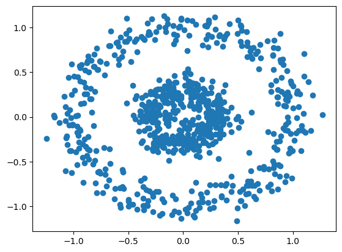
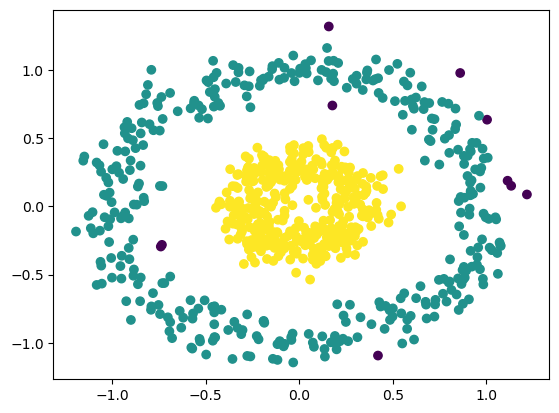
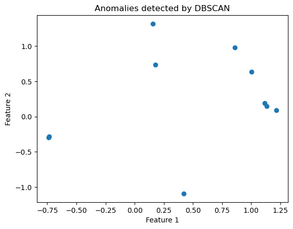

# 🚨 Anomaly Detection using DBSCAN


An unsupervised machine learning project that performs **anomaly detection using DBSCAN**, highlighting noise points based on data density and visualizing normal data and detected anomalies separately.

---

## 📌 Project Overview

This project demonstrates **anomaly detection using DBSCAN (Density-Based Spatial Clustering of Applications with Noise)**. DBSCAN identifies dense regions as clusters and labels sparse, isolated points as anomalies.

The project includes step-by-step visualization of:
- The original dataset  
- Data with anomalies highlighted  
- Only anomaly points after removing normal data  

---

## 📁 Project Structure

- dbscan_anomalydetection.ipynb — Main project notebook  
- data.png — Dataset used for anomaly detection  
- anomalies_highlighted.png — Data with anomaly points highlighted  
- anomalies_only.png — Only detected anomalies (normal points removed)  
- README.md — Project documentation  

---

## ⚙️ Technologies Used

- Python  
- NumPy  
- Pandas  
- Matplotlib  
- scikit-learn  
- Jupyter Notebook  

---

## 🧠 Machine Learning Model

- Algorithm: DBSCAN  
- Learning Type: Unsupervised Learning  
- Distance Metric: Euclidean Distance  
- Key Parameters: eps, min_samples  

---

## 📊 Visual Results

### Original Dataset
Visualization of the dataset before applying anomaly detection.



---

### Anomalies Highlighted
DBSCAN-labeled anomalies highlighted alongside normal data points.



---

### Detected Anomalies Only
Only the anomaly points extracted after removing normal data.



---

## ▶️ How to Run

1. Clone the repository  
```text
git clone https://github.com/btboilerplate/Anomaly-detection-using-DBSCAN.git
```

2. Install required libraries  
```text
pip install numpy pandas matplotlib scikit-learn  
```

3. Open dbscan_anomalydetection.ipynb and run all cells sequentially  

---

## 🧪 Key Observations

- DBSCAN effectively identifies noise points as anomalies  
- No need to specify the number of clusters  
- Works well for non-linear and arbitrarily shaped data  
- Sensitive to eps and min_samples values  

---

## 🚀 Future Improvements

- Tune eps and min_samples automatically  
- Compare with LOF and Isolation Forest  
- Apply to real-world noisy datasets  
- Visualize decision boundaries  

---
